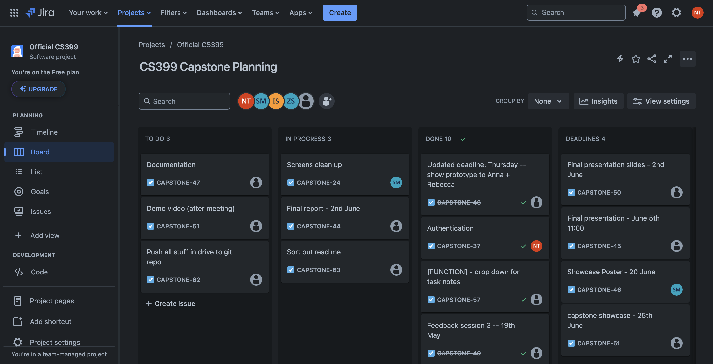
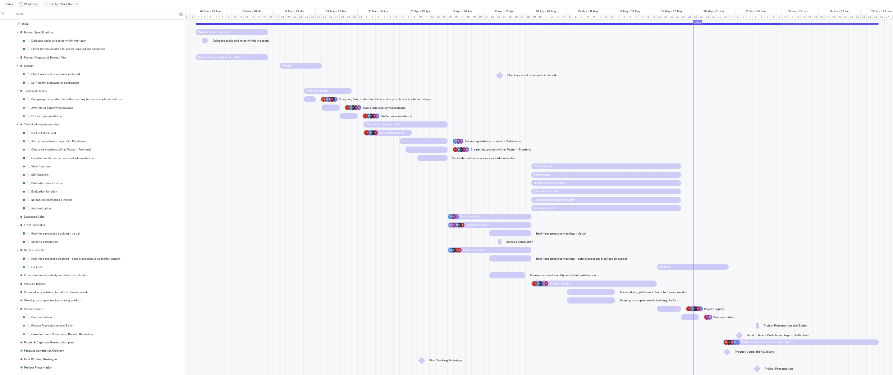

<a name="readme-top"></a>


<!-- PROJECT SHIELDS -->
<!--
*** I'm using markdown "reference style" links for readability.
*** Reference links are enclosed in brackets [ ] instead of parentheses ( ).
*** See the bottom of this document for the declaration of the reference variables
*** for contributors-url, forks-url, etc. This is an optional, concise syntax you may use.
*** https://www.markdownguide.org/basic-syntax/#reference-style-links
-->

<!-- [![Contributors][contributors-shield]][contributors-url]
[![Forks][forks-shield]][forks-url]
[![Stargazers][stars-shield]][stars-url]
[![Issues][issues-shield]][issues-url]
[![MIT License][license-shield]][license-url]
[![LinkedIn][linkedin-shield]][linkedin-url] -->

# Inka

<!-- PROJECT LOGO -->
<br />
<div align="middle">
  <a href="https://github.com/github_username/repo_name">
      
  </a>

  <p align="middle">
        <br />
      Te Tuhi Disability Training Cafe platform for Trainees 
    <!-- <a href="https://github.com/github_username/repo_name"><strong>Explore the docs »</strong></a> -->
    <br />
    <br />
    Damsels in Development are five Computer Science students that have taken papers such as CS230, CS335, and CS345. These papers have given us the proper knowledge and skills in order to develop Inkā.
    <br /><br />
    <r
    <br />
    <a href="https://github.com/github_username/repo_name">View Demo</a>
    ·
  </p>
</div>


<!-- TABLE OF CONTENTS -->
<details>
  <summary>Table of Contents</summary>
  <ol>
    <li><a href="#role-delegations">Role Delegations</a></li>
    <li><a href="#project-information">Project Information</a></li>
    <li><a href="#all-of-the-technologies-used">All of the technologies used</a></li>
    <li><a href="#languages-used">Languages Used</a></li>
    <li>
      <a href="#installation-guide">Installation Guide</a>
      <ul>
        <li><a href="#flutter-installation">Flutter installation</a></li>
        <li><a href="#amplify-cli-intallation-or-update">Amplify CLI intallation or Update</a></li>
        <li><a href="#vscode-installation">VSCode installation</a></li>
        <li><a href="#simulator-installation">Simulator installation</a></li>
        <ul>
          <li><a href="#requirements-for-macos">Requirements for MacOS</a></li>
          <li><a href="#requirements-for-windows">Requirements for Windows</a></li>
          </ul>
      </ul>
    </li>
    <li><a href="#amplify-cli-command-lines">Amplify CLI Command Lines</a></li>
    <li><a href="#github-clone-command-line">Github Clone Command Line</a></li>
    <li><a href="#aws-set-up-documentation">AWS Set-up Documentation</a></li>
    <li><a href="#link-to-video-demo">Link to Video Demo</a></li>
    <li><a href="#disclaimer">Disclaimer</a></li>
    <li><a href="#functions-and-test-cases">Functions and Test Cases</a></li>
    <li><a href="#future-plans">Future Plans</a></li>
    <li><a href="#acknowledgements">Acknowledgements</a></li>
  </ol>
</details>


<!-- ABOUT THE PROJECT -->
## Role Delegations

Frontend Team
- Saacha Moyo - Frontend and UI/UX Developer/Team Leader
  
Full Stack Team
- Istefat Sawda - Full Stack Developer
- Zainab Shehzad - Full Stack Developer
  
Backend Team
- Natania Thomas - Security Engineer/Project Manager
- Eisen Belleza - Backend Developer

<p align="right">(<a href="#readme-top">back to top</a>)</p>


## Project Information

Our application, Inkā, serves as a one-stop shop for the training programs developed by the School of Psychology at The University of Auckland, as well as other partners (Rescare Homes Trust). It functions as a platform for monitoring cafe trainee progress and fostering personalized learning experiences for trainees within the cafe environment.

[Jira Software](https://capstone-cs-399.atlassian.net/jira/software/projects/CAPSTONE/boards/1?atlOrigin=eyJpIjoiMDM0ZDMyZmQ3OTZiNGMzODg4YmJlODAyNmU3MGI3ZjMiLCJwIjoiaiJ9) was our primary project management tool, and we utilised [Click up](https://app.clickup.com/9016213572/v/li/901601710023) to plan out the project timeline. 
Additionally, our client meetings were transcripted by Eisen Belleza which was stored in our [CS399 Google Drive folder](https://drive.google.com/drive/folders/1-gizh0ax6PdQrp2FK9bT6ZF-qECF2oGU?usp=drive_link). We kept track of our client/ group meeting notes, documentations and reports through the same shared google drive. Our group meetings and brainstorming sessions were held on our Discord server and group chat.




<p align="right">(<a href="#readme-top">back to top</a>)</p>


## All of the technologies used

* [![AWS Amplify][Aws-amplify]][Aws-amplify-url] 
    * [![Amplify CLI][Amplify-cli]][Amplify-cli-url]  <sup>version 12.11.0</sup>
    * [![AWS S3][AWS-S3]][AWS-S3-url] <sup>version ^1.0.0</sup>
    * [![AWS Cognito][AWS-Cognito]][AWS-Cognito-url] <sup>version ^1.8.0</sup>
* [![Flutter][Flutter]][Flutter-url] <sup>version version 1.0.0+1</sup>
    * [![Flutter SDK][Flutter-sdk]][Fluttersdk-url] <sup>version >=3.3.3 <4.0.0>
* [![Jira][Jira]][Jira-url]
* [![LucidChart][LucidChart]][LucidChart-url]
* [![GitHub][GitHub]][GitHub-url]
* [![Figma][Figma]][Figma-url]
* [![Xcode Simulator][Xcode-simulator]][Xcode-url] <sup>(macOS) version version 15.3
* [![Android Studio][Android-Studio]][Android-Studio-url] <sup>(Windows) version Iguana | 2023.2.1
* [![Cocoapods][Cocoapods]][Cocoapods-url] <sup>(macOS)version 1.15.2</sup>
* [![VSCode][VSCode]][VSCode-url] <sup>version 1.82.2</sup>
* [![Discord][Discord]][Discord-url]
* [![Ruby][Ruby]][Ruby-url] <sup> (for Cocoapods) version 3.3.0</sup>

<p align="right">(<a href="#readme-top">back to top</a>)</p>

## Languages Used
* [![GraphQL][GraphQL]][GraphQL-url]
* [![Dart][Dart]][Dart-url]

<p align="right">(<a href="#readme-top">back to top</a>)</p>

## Installation Guide

To use Inkā, follow these steps in order to set it up.

### Front end and Backend Installation
Please make sure that you have the following software listed below installed in your environment before cloning our repository.

Required Software for both
- Flutter 
- Amplify Client
- Visual Studio Code
- Simulator

#### Flutter installation
Follow this [documentation](https://docs.flutter.dev/get-started/install) and choose either macOS or Windows depending on your OS and then choose FlutterIOS to set it up 

Run the following command line in terminal to resolve any dependencies
```
flutter pub get
```
Run the following command line in terminal to verify installation of all components.
```
flutter doctor
```

#### Amplify CLI intallation or Update
Follow this [documentation](https://docs.aws.amazon.com/cli/latest/userguide/getting-started-install.html) and choose either macOS or Windows depending on your OS

#### VSCode installation
Follow this [documentation](https://code.visualstudio.com/Download ) and choose either macOS or Windows depending on your OS

#### Simulator installation 

For Mac Users
- Cocoapods
- XCode (you can download this from the AppStore)
- Ruby
  
For Windows Users
- Android Studio

##### Requirements for MacOS
* Cocoapods
  * Put the following code in the command line
    ```
    sudo gem install cocoapods
    ```
  * Follow the rest of the commands in this [documentation](https://docs.flutter.dev/get-started/install/macos/mobile-ios?tab=vscode) under the Install Cocoapods heading
* XCode installation
  * Download and install XCode from the app store
  * To configure, run the following command line
  ```
  sudo sh -c 'xcode-select -s /Applications/Xcode.app/Contents/Developer && xcodebuild -runFirstLaunch'
  ```
  * Then sign the Xcode license
  ```
  sudo xcodebuild -license
  ```
  * To run your Flutter app, follow the steps in [this documentation](https://docs.flutter.dev/get-started/install/macos/mobile-ios?tab=vscode) under  Configure you iOS simulator heading
* Ruby installation
  * The default Ruby installation can be used for MacOS
  * Make sure to [install Homebrew ](https://docs.brew.sh/Installation )in not already installed
  * Put the following code in the command line
    ```
    brew install ruby
    ```
  * Follow the rest of the commands in this [documentation](https://www.ruby-lang.org/en/documentation/installation/)

##### Requirements for Windows

Android Studio installation:

Follow the [documentation](https://developer.android.com/studio) for any questions outside of the given installation guide below.
* Update the version in the this line inside the file (android > settings.gradle)
  * `id "org.jetbrains.kotlin.android" version "1.8.10"`
  * The version will be dependent on what is the latest. However, the terminal will indicate which version you should be running if this version is no longer compatible. 1.8.10 was the current version during this time.
* Update the sdkVersion in this line inside the file (android > app > build.gradle)
  * `compileSdkVersion 34`
  * `minSdkVersion 24`
  * The version will be dependent on what is the latest. However, the terminal will indicate which version you should be running if this version is no longer compatible. 24 and 34 were the current version during this time.
* Check to make sure that the file path for the Android Emulator is correct in your VSC settings. 
  * To see file path in Android Studio (Settings > Languages and Frameworks > Android SDK). Android SDK Location is shown at the very top.
  * To see file path in VSC (Settings > type in ‘android’ in the search bar). Emulator Path is shown at the third line.
  * Emulator Path should be the file path as shown in the Android Studio. If the path is incorrect, copy and paste the file path from Android Studio into VSC.


After you have installed and configured the aforementioned services, simply clone our repository either in a terminal or on GitHub itself. 

Once you have a clone of our repository, open up Visual Studio Code and open the extracted file.

<p align="right">(<a href="#readme-top">back to top</a>)</p>

## Amplify CLI Command Lines
If there is no “Models” folder inside /lib, use this command line to generate data models inside your Flutter project: 
```
amplify codegen models
```
To pull and connect the Amplify project into your Flutter project, use this command line: 
```amplify pull [generated-amplify-name]```
You can copy-paste this command line from Amplify Studio itself at the dashboard on the website as the generated-amplify-name is unique but is not human-friendly to remember.

Make sure that the __amplify_config__ file is up to date as it can cause errors with the project when running it.

<p align="right">(<a href="#readme-top">back to top</a>)</p>

## Github Clone Command Line
```
git clone https://github.com/uoa-compsci399-s1-2024/capstone-project-2024-s1-team-13
```

## AWS Set-up Documentation
We have included an AWS [documentation](https://docs.google.com/document/d/17ZWbsLJndr8A0jwiOuvkP9uwAZ9P8AkxaGnu-Ex6398/edit) to help with setting up the project on AWS. Please refer to this document when initialising a new Amplify project. We have included screenshots inside the document as a reference if you are unable to proceed to the next instruction. 

<p align="right">(<a href="#readme-top">back to top</a>)</p>

## Link to Video Demo
[link goes here]

<p align="right">(<a href="#readme-top">back to top</a>)</p>

## Disclaimer
Inside the backend folder in Amplify, all of the functions are empty since our backend functions are included on the frontend screens. We were unable to connect Amplify and Lambda. 

For the data models, we are not making use of the CurrTask table. 

<p align="right">(<a href="#readme-top">back to top</a>)</p>

## Functions and Test Cases
There is a summary of the core functionalities of the app below: 

**Trainee Evaluation and Data Manipulation**:<br />
 -  **Support Workers:** Can manipulate existing data (trainee and task notes) and evaluate trainee progress.<br />

<div style="display: flex; justify-content: space-around; gap: 30px;">
    
    
    

</br>
    
    

</div>

 -   **Admins:** Have broader access to manipulate all data, including trainee progress, but cannot evaluate trainees.
    
<div style="display: flex; justify-content: space-around; gap: 30px;">
     
    
    
</div>

<br /><br />

- **Training Modules:** Accessible without login, allowing trainees to go through task/recipe steps using cue cards and a text-to-speech option.
<div style="display: flex; justify-content: center; gap: 50px;">
    
    

</div>


<br/>
We have provided a thorough explanation of the test cases made, this is the link for the [Inkā Test Case Documentation](https://docs.google.com/document/d/1XAhk4qNIOTb1GPFFwL1Eew_QfBtGGWhFafHnu6uACUM/edit?usp=sharing). 

<p align="right">(<a href="#readme-top">back to top</a>)</p>

## Future Plans
* Logging
  If any changes are made to the system e.g. adding/editing/deleting/archiving, it would be handy for the cafe to have a history log, showing exactly what the changes were, in the case that something needed to be reviewed. If the user requests a log report, this can be sent directly to an email connected to the account
* Exporting
  Based on the trainee’s sessions and their progress, if the cafe would like to download their work in either pdf or excel format, they would have this option. Or if they would like to see the sessions in a monthly format to help the support workers to see the training in a different and more consolidated way. 
* Distribution of the application
  During the duration of the project there were conversations about how this application could be used in different countries. It would be beneficial for the cafe, if we could implement something that ensured that the different cafes could have different applications with no information from the separate cafes, for example, they would start with a whole new application and build that from the ground up. 
* Customisation
  We could include a customisation feature where If the clients would like to change the theme, or customize the application specific to the trainee , then it would be saved within the specific trainee’s profile.

* Extra Aesthetics
  * Distinction in background for support and admin
  * An information button for new users who are unsure of the functionalities
  * Auto correct function
  * Time out the session if exceeding a long period of time or a message pop up asking if a session continuance is required - determine whether there needs to be a session limit (something the cafe can configure)
  * To maximise screen space, we can move the navigation bar at the bottom and create a burger menu for this
  * In the event that the app crashes, the application should retain the information, like a cache memory stored locally on the iPad and then this will be loaded once the app restarts
  * Should be more obvious which trainee is being evaluated or trained - with the name at the top of the screen

<p align="right">(<a href="#readme-top">back to top</a>)</p>

## Acknowledgements

We want to give a shout out to Osama our tutor for the guidance and reassurance, to Anna for encouraging us and getting just as excited as us about the project.

We appreciate the Amplify Documentation pages, YouTube videos and other documentation which helped the team in troubleshooting and learning the ins and outs of parts of the project

We want to thank the clients for giving us an impactful real world experience and for the feedback they provided which helped us grow both professionally and personally.

<p align="right">(<a href="#readme-top">back to top</a>)</p>


<!-- MARKDOWN LINKS & IMAGES -->
<!-- https://www.markdownguide.org/basic-syntax/#reference-style-links -->

<!-- app images --> 


[Aws-amplify]: https://img.shields.io/badge/Aws_amplify-FF9900?style=for-the-badge&logo=aws-amplify&logoColor=white
[Aws-amplify-url]: https://docs.amplify.aws/
[Amplify-cli]: https://img.shields.io/badge/Amplify_CLI-FF9900?style=for-the-badge&logo=aws-amplify&logoColor=white
[Amplify-cli-url]: https://docs.amplify.aws/cli/
[AWS-S3]: https://img.shields.io/badge/AWS_S3-569A31?style=for-the-badge&logo=amazon-s3&logoColor=white
[AWS-S3-url]: https://aws.amazon.com/s3/
[AWS-Cognito]: https://img.shields.io/badge/AWS_Cognito-FF9900?style=for-the-badge&logo=aws-cognito&logoColor=white
[AWS-Cognito-url]: https://aws.amazon.com/cognito/
[Flutter]: https://img.shields.io/badge/Flutter-02569B?style=for-the-badge&logo=flutter&logoColor=white
[Flutter-url]: https://flutter.dev/
[Flutter-sdk]: https://img.shields.io/badge/Flutter_SDK-02569B?style=for-the-badge&logo=flutter&logoColor=white
[Fluttersdk-url]: https://docs.flutter.dev/tools/sdk
[Jira]: https://img.shields.io/badge/Jira-0052CC?style=for-the-badge&logo=jira&logoColor=white
[Jira-url]: https://www.atlassian.com/software/jira
[LucidChart]: https://img.shields.io/badge/LucidChart-FC7335?style=for-the-badge&logo=lucidchart&logoColor=white
[LucidChart-url]: https://www.lucidchart.com/
[GraphQL]: https://img.shields.io/badge/GraphQL-E10098?style=for-the-badge&logo=graphql&logoColor=white
[GraphQL-url]: https://graphql.org/
[Dart]: https://img.shields.io/badge/Dart-0175C2?style=for-the-badge&logo=dart&logoColor=white
[Dart-url]: https://dart.dev/
[GitHub]: https://img.shields.io/badge/GitHub-181717?style=for-the-badge&logo=github&logoColor=white
[GitHub-url]: https://github.com/
[Figma]: https://img.shields.io/badge/Figma-F24E1E?style=for-the-badge&logo=figma&logoColor=white
[Figma-url]: https://www.figma.com/
[Xcode-simulator]: https://img.shields.io/badge/Xcode-1575F9?style=for-the-badge&logo=xcode&logoColor=white
[Xcode-url]: https://developer.apple.com/xcode/
[Android-Studio]: https://img.shields.io/badge/Android_Studio-3DDC84?style=for-the-badge&logo=android-studio&logoColor=white
[Android-Studio-url]: https://developer.android.com/studio
[Cocoapods]: https://img.shields.io/badge/Cocoapods-EE3322?style=for-the-badge&logo=cocoapods&logoColor=white
[Cocoapods-url]: https://cocoapods.org/
[VSCode]: https://img.shields.io/badge/VSCode-007ACC?style=for-the-badge&logo=visual-studio-code&logoColor=white
[VSCode-url]: https://code.visualstudio.com/
[Discord]: https://img.shields.io/badge/Discord-5865F2?style=for-the-badge&logo=discord&logoColor=white
[Discord-url]: https://discord.com/
[Ruby]: https://img.shields.io/badge/Ruby-CC342D?style=for-the-badge&logo=ruby&logoColor=white
[Ruby-url]: https://www.ruby-lang.org/en/

